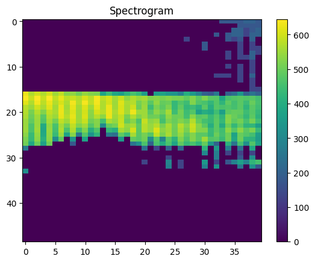
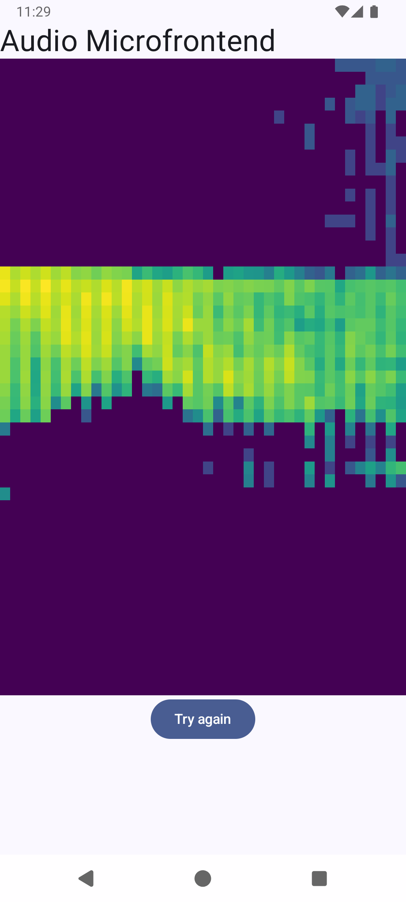

# Android Audio Microfrontend

This project is a port of Tensorflow's *microfrontend* framework for Android, inspired
by [multilingual_kws](https://github.com/harvard-edge/multilingual_kws) project and the usage of this framework to generate feature vectors of audio samples.

The library generates a feature vector (a custom MFCC spectrogram) from an input audio. It's just fast.


## Usage
1. Obtain an audio sample of one second length, PCM mono and with a sample rate of 16000. Source can be the mic or an assets WAV file.
2. Convert such audio samples into a ShortArray. You can use AudioUtils object:
    ```kotlin
    import com.jamstudios.microfrontend.AudioUtils

    // From a WAV file
    val audioArray = AudioUtils.decodeMonoWaveFileAsShortArray(file)

    // Or from a PCM Byte array
    val audioArray = AudioUtils.pcm16ByteArrayToShortArray(pcmBytes)
    ```
3. Use the *FeatureExtractor* class to obtains the features vector:
    ```kotlin
    import com.jamstudios.microfrontend.FeatureExtractor

    // Init with audio sample rate
    val featureExtractor = FeatureExtractor()
    featureExtractor.init(16000)

    // Obtain the features array
    val featuresArray: ShortArray = featureExtractor.process(audioArray)
    ```
5. For an audio data array of 1 second length and 16000 samples, the result will be a ShortArray with 1960 values. As a spectrogram, this is a image of 40x49 (width x height), similar to this:




## Generate AAR

The next steps generate an AAR file that can be used in other apps.

1. Get tensorflow submodule:
    ```bash
    git submodule update
    ```
2. Download and uncompress third party libraries using this command:
    ```bash
    ./setup.sh
    ```
3. Build using gradle:
    ```bash
    # You may need to set the Android SDK path
    export ANDROID_HOME=~/Android/Sdk

    # Built
    ./gradlew :microfrontend:assembleRelease
    ```
4. Generated file will be in *microfrontend/build/outputs/aar* folder.


## Use AAR file as library in your own app
1. To use this AAR file as a library, in your app folder, copy the file inside libs folder.
    ```bash
    cp <android_audio_microfrontend_path>/microfrontend/build/outputs/aar/microfrontend-release.aar <your_app_path>/app/libs/
    ```
2. Add libs folder to *settings.gradle.kts* on repositories section. Example:
    ```kotlin
    repositories {
        ...
        flatDir {
            dirs("libs")
        }
    }
    ```
3. Add the implementation to *build.gradle.kts* (app level) on dependencies section. Example:
    ```kotlin
    dependencies {
        implementation(files("libs/microfrontend-release.aar"))
        ...
    }
    ```

## Example app



The Android app uses this *microfrontend* library to generate the spectrogram of a sample audio. At main view, shows such spectrogram using the viridis color map.


## License
MIT